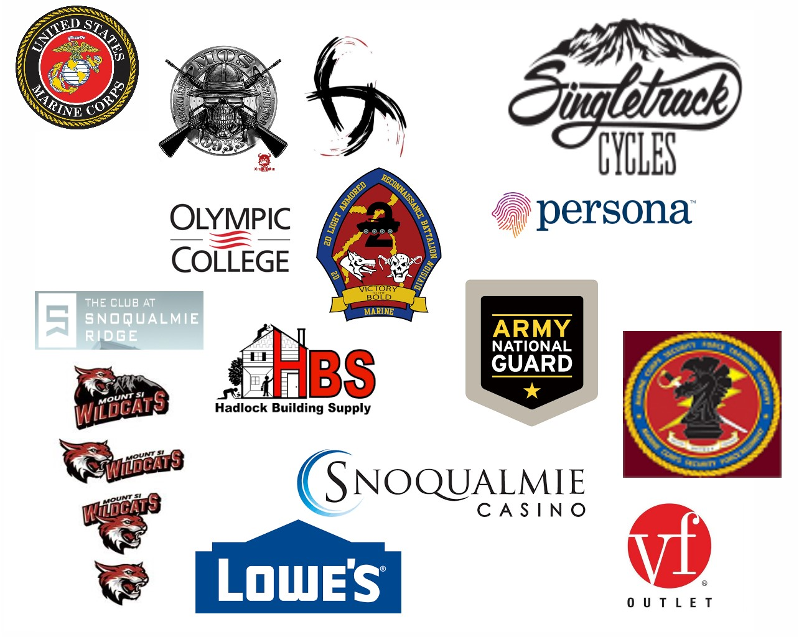

### 

- Graduated High School from Two Rivers Alternative in 2009

- Graduated from bootcamp March 2009 with fitness and motivation awards.
- Marksmanship Coach Course. 
- Corporals Leadership ourse with motivation award.
- Marine Security Forces Course.
- Close Quarters Battle Instructor Course.
- Code Fellows 102, 201, 301, 401 Javascript courses.

## Some of my Skills....
 - Decisive (decision maker)
 - Motivated
 - Quick Thinking in stressful situations
 - Great at playing the air guitar

## Task Approach 
- Gather data
- determine what finished product would look like
- setup a COA(course of action) step by step
- perform same steps on each step of the process (recursion).
basically, I break everything down into very small pieces. once each piece cant be broken down then I can start working on that piece or move onto the next piece when finished.  

<a href="https://jovial-goldwasser-8cea91.netlify.app/competencies/">
   
Competencies

</a>